Data and code for “DECIPHER-seq uncovers cell-cell interaction networks in the human breast” (Murrow et al.)
------------------------------------------------------------------------------------------------------------

Included is the code needed to replicate key findings from Murrow et al. 
Raw gene expression, barcode count matrices, and processed data will be 
uploaded to the Gene Expression Omnibus (insert GEO ID here). 

Any additional information required to reproduce the data in this
study is available from the corresponding authors upon request.

``` r
renv::restore()
```

Integrated breast dataset with cell type clustering
---------------------------------------------------

Here, we’ve chosen to read in and plot a subset of the full dataset for
speed.

``` r
library(Seurat)
library(ggplot2)

source('R/DECIPHER-seq.functions.R')
source('R/DECIPHER-seq.util.R')

breast.data.sub <- readRDS('Data/breast.data.sub.rds')
```

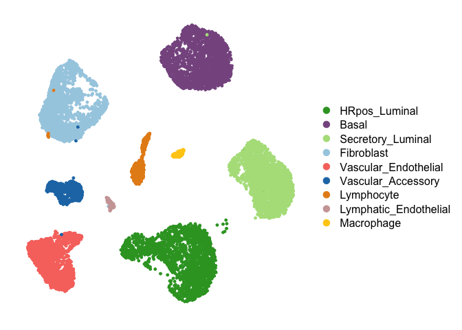

Define Activity Programs
------------------------

First, we run consensus iNMF (using the LIGER package) across a range of
K values. A heuristic for the maximum value of K for the sweep can be
chosen by inspecting PC elbow plots for each cell type. Here, we chose a
range of 2 to 40 for all cell types.

``` r
library(rliger)
library(RANN)

breast.data <- readRDS('Data/breast.data.rds')
NMF_results <- iNMF_ksweep(breast.data, k.max = 40)
```

Alternatively, read in the consensus iNMF results from the (entire)
processed dataset instead of rerunning the full workflow.

``` r
NMF_results <- readRDS('Data/NMF_results.rds')
```

Build phylogenetic trees for K optimization workflow

``` r
library(rlist)
library(ape)
library(matrixStats)

phylo_trees <- lapply(NMF_results, build_phylo_tree)
```

Identify “outlier” activity programs representing rare contaminating
cells and plot phylo partitions

``` r
program_outlier_score <- lapply(NMF_results, identify_outlier_programs)
```

Choose distance threshold and partition phylogenetic trees

``` r
library(patchwork)

suggested_thresholds = suggest_dist_thresh(phylo_trees)
thresh_use = round(max(suggested_thresholds), 1)
p = plot_hists(phylo_trees, thresh.use = thresh_use)

p[[1]]+p[[3]]+p[[2]]+p[[4]]+p[[5]]
```

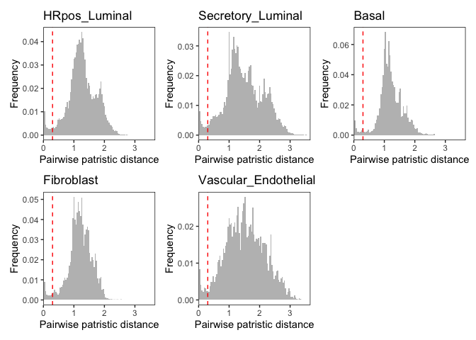

``` r
library(geiger)
library(igraph)

suggested_thresholds = suggest_dist_thresh(phylo_trees)
thresh_use = round(max(suggested_thresholds), 1)
phylo_partitions = mapply(partition_phylo_tree, x = phylo_trees, y = program_outlier_score, dist.thresh = thresh_use, outlier.thresh = 5, SIMPLIFY = F)
```

``` r
par(mfrow=c(1,5), mar=c(2.5,5.5,1,1))
plot_phylo_trees(phylo_trees, phylo_partitions)
```

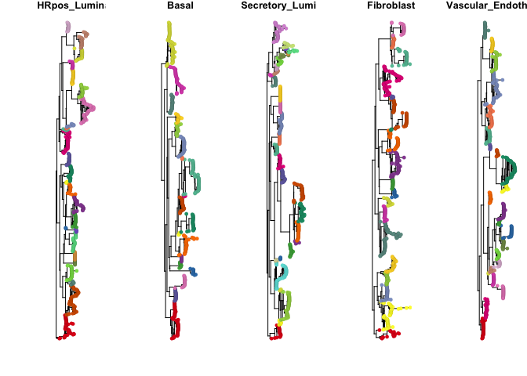

Plot K metric (number of weighted subtrees identified at each choice of
NMF rank)

``` r
library(dplyr)
K_metrics = lapply(phylo_partitions, calculate_K_metric)
k.use = lapply(K_metrics, suggest.k)
print(unlist(k.use))
```

    ##        HRpos_Luminal                Basal    Secretory_Luminal 
    ##                   26                   23                   24 
    ##           Fibroblast Vascular_Endothelial 
    ##                   24                   23

``` r
par(mfrow=c(5,1), mar=c(2.5,5.5,1,1))
for (i in 1:length(K_metrics)){
  plot(2:(dim(K_metrics[[i]])[1]+1), K_metrics[[i]]$weighted_n_subtrees,
       ylab = "Weighted N subtrees", xlab = "NMF Rank K", 
       main = names(K_metrics)[i], pch = 16, col = cell_type_cols[i], type = "b")
  abline(v = k.use[[i]])
}
```

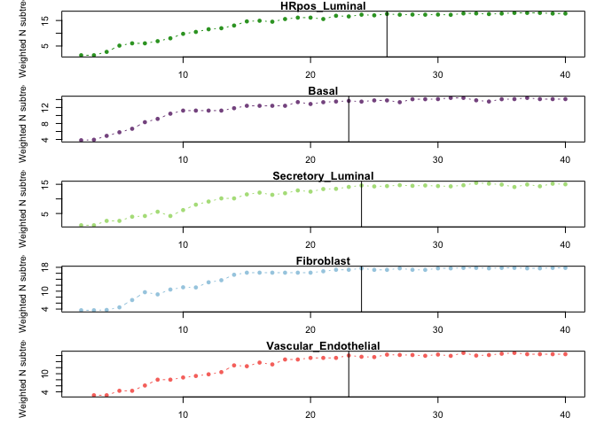

Select NMF results at optimized K values and filter “outlier” programs
representing expression in rare cells.

``` r
NMF_results_atK <- mapply(FUN = NMF_results_opt_k, NMF_results, k.use, program_outlier_score, SIMPLIFY = F)
```

Construct DECIPHER-seq network
------------------------------

Calculate the average expression score of each activity program in each
sample

``` r
metadata <- readRDS('Data/breast.data.metadata.rds')
Expression_score = mapply(NMF_results = NMF_results_atK, metadata = list(metadata), FUN = calc.H.score, SIMPLIFY = F)
```

Calculate pairwise Pearson correlations of average sample expression
scores for each activity program, perform BCA bootstrap resampling to
estimate confidence intervals

``` r
source("R/boot.cor.complete.R")
source("R/cor.m.boot.test.R")
library(wBoot)
library(parallel)

Expression_score_cor = cor.m.boot.test(list.cbind(Expression_score), null.hyp = 0, alternative="two.sided")
Expression_score_cor$sig.cor = Expression_score_cor$cor
Expression_score_cor$sig.cor[which(Expression_score_cor$p> 0.05)] = NA
```

Build weighted network.

``` r
Network <- Construct_network(Expression_score_cor)
```

Perform community detection.

``` r
library(reticulate)
adjacency_matrix <- Network$mat
py_run_string("import leidenalg as la; import igraph as ig; import numpy as np")
py_run_string("G = ig.Graph.Weighted_Adjacency(r.adjacency_matrix.tolist())")

# sweep across a range of resolutions
py_run_string("optimiser = la.Optimiser()")
py_run_string("profile = optimiser.resolution_profile(G, la.CPMVertexPartition, 
        weights = 'weight', resolution_range=(0.001, 0.4), number_iterations = 0)")
sweep = py$profile
modularity = lapply(sweep, function(x){x$modularity})
# Use "resolution" that gives max modularity
partition_use = sweep[[which.max(unlist(modularity))]]
py_run_string("partition = r.partition_use")
py_run_string("diff = optimiser.optimise_partition(partition)")

# Optimise this partition
while(py$diff!=0){
  py_run_string("diff = optimiser.optimise_partition(partition)")
  py_run_string("print(diff)")
}
clustering_res = py$partition
modules = clustering_res$membership + 1
names(modules) = colnames(adjacency_matrix)
Network$modules = modules
```

Filter isolated nodes and modules using weighted topological overlap.

``` r
library(wTO)
Network <- Filter_network(Network)
```

Plot results (pre- and post-filtering).

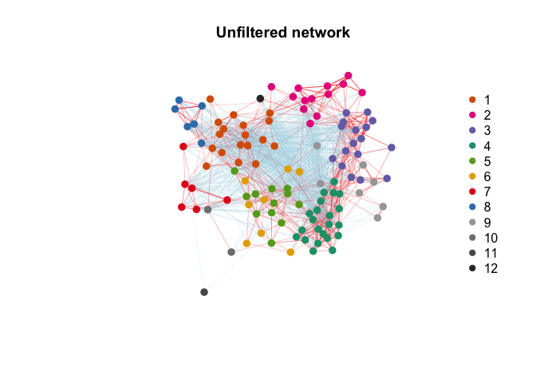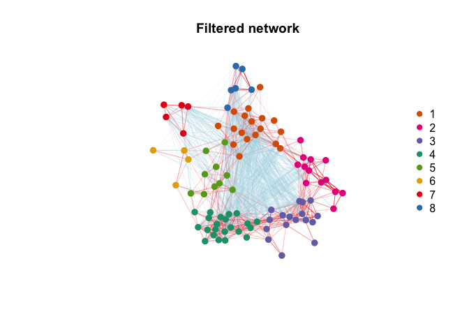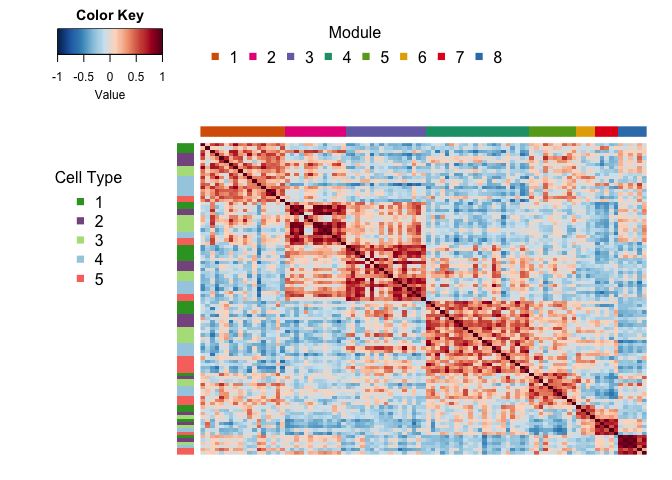

Downstream analyses of DECIPHER-seq network
-------------------------------------------

### Identify activity programs with similar gene loadings

Infer non cell type specific responses, e.g. in response to a shared cue
or common microevironment. Non-specific gene signatures (such as
artifacts of tissue processing) would also be expected to display
similar gene loadings.

``` r
gene_correlation_matrix <- Gene_similarity(NMF_results_atK)
gene_similarity_node_pvals <- Permutation_test_gene_cor(Network, gene_correlation_matrix)

edge_weights_fisher = abs(FisherZ(edge.attributes(Network$filtered_network)$weight*edge.attributes(Network$filtered_network)$sign))
plot(Network$filtered_network, layout = Network$filtered_network_coords, 
     vertex.color=colorRampPalette(c("grey", "red"))(100)[cut(-log10(gene_similarity_node_pvals), breaks = c(0, seq(-log10(0.01), 4, length.out = 100)))],
     edge.width=0.25, vertex.label.cex=0.5, vertex.size = 7, vertex.label.color="black", 
     vertex.label.family="Helvetica", vertex.frame.color=NA, vertex.label.font=2, vertex.label = NA,
     edge.color = c(NA, "grey20")[factor(E(Network$filtered_network)$sign>0)],
     main = "Gene loading similarity within module")
legend_image <- as.raster(matrix(rev(colorRampPalette(c("grey", "red"))(100)), ncol=1))
text(x=1.9, y = c(-0.4,0.4), labels = c("1e-2", "1e-4"), cex = 0.7)
rasterImage(legend_image, 1.55, -0.45, 1.7,0.45)
```

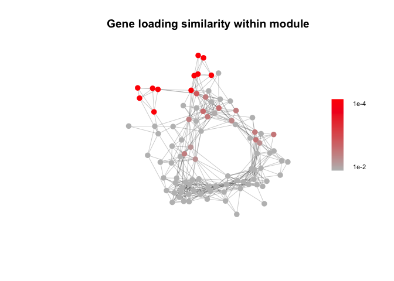

### Infer high-confidence direct cell-cell interactions.

This simplified model does not consider the effects of signal
amplification, cooperation between signaling pathways, or higher-order
interactions between more than two cell types, but can be used to
identify a subset of “high-confidence” direct cell-cell interactions
that meet a series of simple criteria. Only test for cell types where
the single-cell dataset reflects the tissue composition (e.g. cell types
where dissociation artifacts are minimized and sort gates that don’t
enrich for one cell type selectively).

``` r
library(broom)

interaction_term_res = Infer_direct_interactions(Expression_score, Network, metadata, celltypes.test = c("HRpos_Luminal", "Secretory_Luminal", "Basal"), sort.gate = c("Live_singlet", "Epithelial"))
```

    ## Testing direct interactions between cell types: HRpos_Luminal, Secretory_Luminal, Basal

    ## Testing cells in sort gate: Live_singlet, Epithelial

``` r
mat = interaction_term_res$adjacency_matrix
mat[is.na(mat)] = 0
network_directed <- graph_from_adjacency_matrix(t(mat), weighted=T, mode="directed", diag=F)

plot.igraph(Network$filtered_network, layout = Network$filtered_network_coords, 
            vertex.color=network_module_cols[factor(Network$filtered_modules)],vertex.label = NA,
     edge.width=0.5*edge_weights_fisher, vertex.label.cex=0.5, vertex.size = 7, vertex.label.color="black", 
     vertex.label.family="Helvetica", vertex.frame.color=NA, vertex.label.font=2,
     edge.color = c(NA, "grey50")[factor(E(Network$filtered_network)$sign>0)])
plot.igraph(network_directed, layout = Network$filtered_network_coords, 
            vertex.color= alpha("black", 0),
            edge.width=2, vertex.label.cex=0.5, vertex.size = 3, vertex.label.color="black", 
            vertex.label.family="Helvetica", vertex.frame.color=NA, vertex.label.font=2,
            edge.color = "black",
            vertex.label = NA, edge.arrow.size = 0.3, edge.arrow.width = 2, add = T)
```

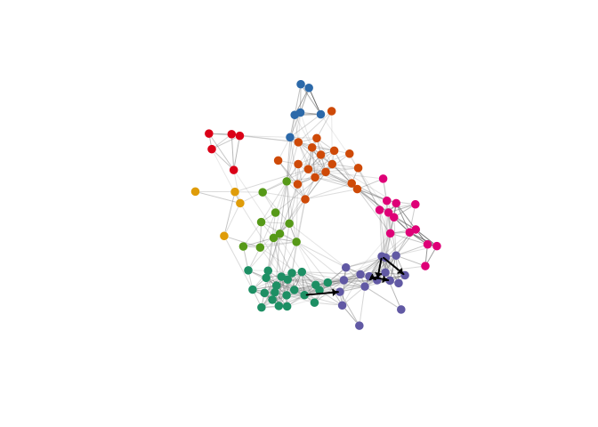

### Gene Set Enrichment Analysis

##### Marker gene analysis

Identify marker genes statistically associated with each gene program,
using ordinary least squares regression of each gene’s normalized
(z-scored) expression against the activity program expression score
(e.g. cell “expression”) for each program in each cell type, after
filtering genes not expressed in that cell type

``` r
marker_gene_list <- Marker_gene_analysis(NMF_results_atK, NMF_results)
```

##### Gene set enrichment

Perform gene set enrichment analysis across activity programs in the
DECIPHER-seq network.

``` r
library(fgsea)
library(msigdbr)

# Targeted Gene Sets: luteal phase (Pardo et al.) and involution-related (Stein et al.)
path_list = readRDS('Data/genesets/targeted_pathways.rds')["Pardo"]
Pardo_fgsea_res = fgsea_test(marker_gene_list, Network, path_list)

path_list = readRDS('Data/genesets/targeted_pathways.rds')["Stein"]
Stein_fgsea_res = fgsea_test(marker_gene_list, Network, path_list)

# GO Biological Processes
path_df = msigdbr(species = "Homo sapiens", category="C5")
path_df=subset(path_df, gs_subcat%in%c("GO:BP"))
path_list = path_df %>% split(x = .$gene_symbol, f = .$gs_name)
GO_BP_fgsea_res = fgsea_test(marker_gene_list, Network, path_list)

# Hallmark Gene Sets
path_df = msigdbr(species = "Homo sapiens", category="H")
path_list = path_df %>% split(x = .$gene_symbol, f = .$gs_name)
Hallmark_fgsea_res = fgsea_test(marker_gene_list, Network, path_list)
```

Plot enrichment of selected gene sets.

``` r
# A few example plots
plot_fgsea(Network, Pardo_fgsea_res, "Pardo", fdr_min = 1e-10)
```

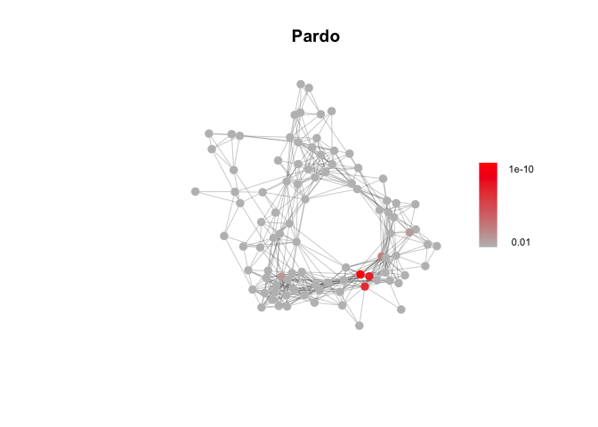

``` r
plot_fgsea(Network, Stein_fgsea_res, "Stein", fdr_min = 1e-4)
```

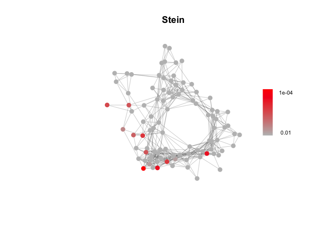

``` r
plot_fgsea(Network, Hallmark_fgsea_res, "HALLMARK_HYPOXIA", fdr_min = 1e-20)
```

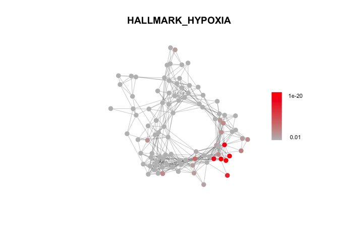

##### Enrichment in modules

Identify gene sets enriched across modules in the DECIPHER-seq network.

``` r
# choose gene sets to test
sets_to_test = rbind(Stein_fgsea_res, Pardo_fgsea_res, GO_BP_fgsea_res, Hallmark_fgsea_res)

enrichment_pval = Get_enrichment_pvals(sets_to_test, Network)
```

    ##                           GOBP_CIRCULATORY_SYSTEM_DEVELOPMENT 
    ##                                                     9.999e-05 
    ## GOBP_POSITIVE_REGULATION_OF_PEPTIDYL_TYROSINE_PHOSPHORYLATION 
    ##                                                     9.999e-05 
    ##                               GOBP_PYRUVATE_METABOLIC_PROCESS 
    ##                                                     9.999e-05 
    ##          GOBP_REGULATION_OF_PEPTIDYL_TYROSINE_PHOSPHORYLATION 
    ##                                                     9.999e-05 
    ##                                        GOBP_TISSUE_REMODELING 
    ##                                                     9.999e-05

#### Association with metadata features

Measure the effect size and p-values for association with metadata
features. Mann-Whitney test and Wilcoxon effect size (r) for binary
features, linear regression and Pearson correlation (r) for continuous
features.

``` r
library(rstatix)

# for binary variables, create a metadata column with only two levels
metadata$Parity.Y.N[metadata$Parity.Y.N=="unknown"] = NA
metadata$Parity.Y.N = factor(metadata$Parity.Y.N, levels = c("yes", "no"))
Parity_effect_size = Calculate_metadata_associations(Network, Expression_score, metadata, feature.to.test = "Parity.Y.N", type = "binary")

BMI_effect_size = Calculate_metadata_associations(Network, Expression_score, metadata, feature.to.test = "BMI", type = "continuous")
```

    ## Warning in Calculate_metadata_associations(Network, Expression_score,
    ## metadata, : Converting metadata feature.to.test to continuous variable

``` r
metadata$HC_use[metadata$HC_use=="progestin"] = NA
metadata$HC_use = factor(metadata$HC_use, levels = c("combined", "none"))
HC_use_effect_size = Calculate_metadata_associations(Network, Expression_score, metadata, feature.to.test = "HC_use", type = "binary")
```

``` r
Plot_metadata_association(Network, Parity_effect_size, plot.title = "Parity")
```

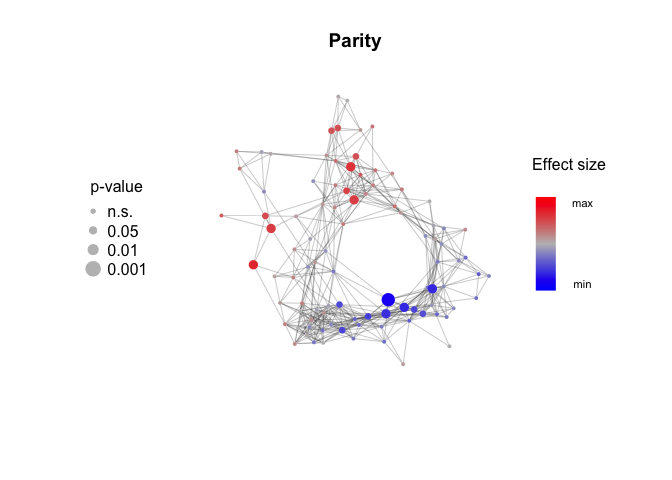

``` r
Plot_metadata_association(Network, BMI_effect_size, plot.title = "BMI")
```

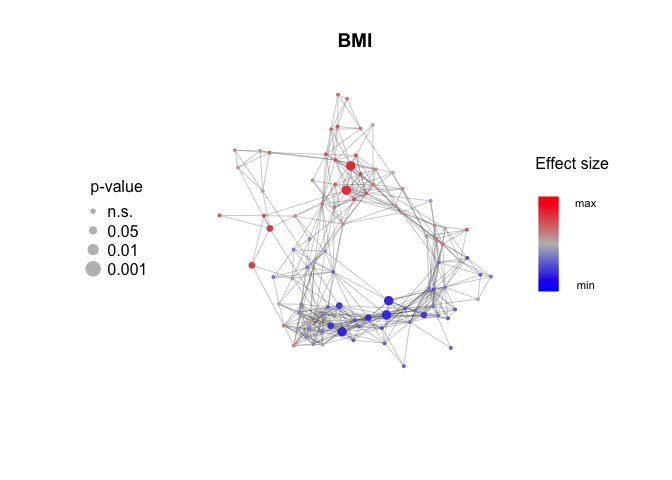

``` r
Plot_metadata_association(Network, HC_use_effect_size, plot.title = "Combined HC Use")
```

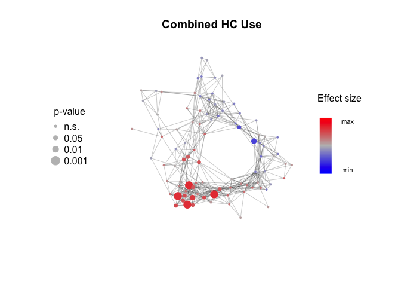
